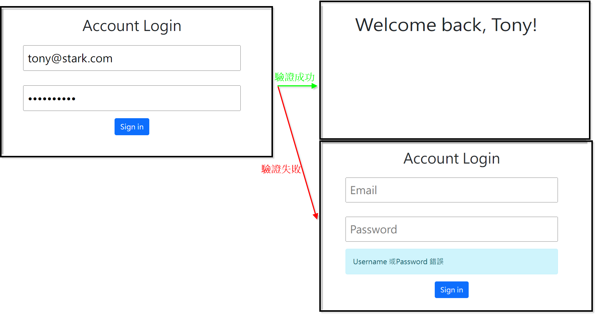

# 簡單版登入介面


## 介紹
測試用的登入功能，辨別輸入的 email 及密碼是否符合內建名單

### 功能
- 輸入 email 及密碼，若都正確則進入歡迎介面
- 成功登入後可查看個人資料

### 開始使用
1. 需有安裝 Node.js 以及 npm
2. 將此專案 clone 至本地
3. 從終端機進入此專案資料夾，輸入以下指令安裝套件
```
npm install
```
4. 安裝完畢後，輸入以下指令啟動專案
```
npm run start
```
5. 若終端機顯示 "The Express server is listening on localhost:3000" 則代表專案運行正常，請打開瀏覽器輸入以下網址
```
http://localhost:3000
```
6. 若需種子資料，可執行以下指令
```
npm run seed
```
7. 終止專案請於終端機輸入
```
ctrl + c
```
# 開發工具
- Node.js 18.17.0
- Express 4.17.1
- Express-Handlebars 4.0.2
- MongoDB
- mongoose 5.9.7